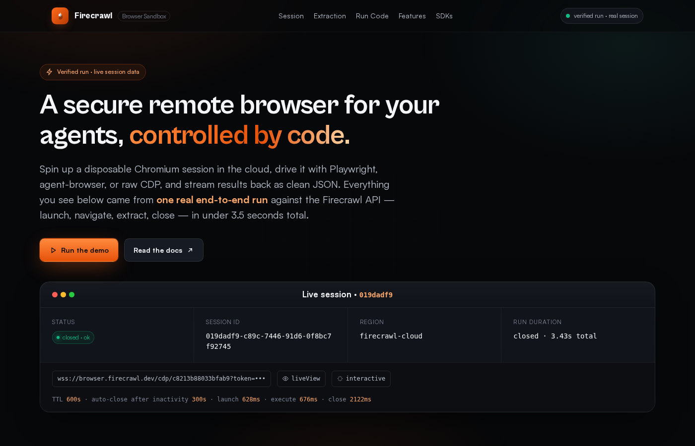

# Firecrawl Browser Sandbox — Live Demo Dashboard

A production-grade, single-page dashboard that showcases the **[Firecrawl Browser Sandbox](https://docs.firecrawl.dev/features/browser)** — a disposable, cloud-hosted Chromium session you can drive with Playwright, `agent-browser`, or raw CDP.

The dashboard ships with two modes:

| Mode        | How it works                                                                           | When to use                  |
| ----------- | -------------------------------------------------------------------------------------- | ---------------------------- |
| **Replay**  | Plays back a real end-to-end run baked into `index.html` (session id, timings, HN payload). | Default. Zero infra, no key. |
| **Live**    | Hits a tiny **proxy** that talks to the Firecrawl API using a server-side key.        | Show the real thing.         |

> The proxy is the only way to keep your `fc-...` key off the client. Never ship the key in the static bundle.

---

## Live demo

- Baked run: `session 019dadf9…`, **3.43s** end-to-end, 5 HN stories, 2080 pts total.
- Full per-step log: launch → navigate → extract → close.



---

## Repo layout

```
.
├─ index.html                # the entire dashboard (one file, zero build step)
├─ config.js                 # sets window.FIRECRAWL_PROXY at runtime
├─ live_run.json             # snapshot of the verified end-to-end run
├─ worker/                   # lightweight proxy
│  ├─ index.js               #   Cloudflare Worker implementation
│  ├─ wrangler.toml          #   Worker config (ALLOWED_ORIGINS, rate limit)
│  ├─ server-node.mjs        #   Identical proxy as a plain Node HTTP server
│  └─ package.json           #   wrangler devDep + helper scripts
├─ .github/workflows/        # CI: deploys Worker on push to main
│  └─ deploy-worker.yml
└─ README.md
```

---

## 1. Run the static site locally

No build, no npm. Any static server works.

```bash
cd firecrawl-sandbox-demo
python3 -m http.server 5050
# visit http://localhost:5050
```

In **replay mode** (the default) the Run button auto-plays the baked session — perfect for a 30-second demo.

---

## 2. Stand up the proxy

The proxy exposes three endpoints that mirror the Firecrawl API and inject `Authorization: Bearer fc-...` server-side:

| Method   | Path                    | Forwards to                                        |
| -------- | ----------------------- | -------------------------------------------------- |
| `POST`   | `/api/launch`           | `POST /v2/browser`                                 |
| `POST`   | `/api/execute/:id`      | `POST /v2/browser/:id/execute`                     |
| `DELETE` | `/api/close/:id`        | `DELETE /v2/browser/:id`                           |
| `GET`    | `/api/health`           | local, for uptime checks                           |

**Built-in hardening** (both variants):

- CORS allowlist (`ALLOWED_ORIGINS`, comma-separated, or `*`).
- Per-IP token-bucket rate limit (`RL_LIMIT` / `RL_WINDOW_SEC`).
- Language whitelist: `node` / `python` / `bash` only.
- Code-size cap: **16 KiB** per request.
- Response field whitelist — the raw `cdpUrl` (which contains a session token) is redacted to `cdpHost` before returning to the browser. `liveViewUrl` is forwarded (it's already a screencast-only token).
- `stdout` / `stderr` / `result` clipped to sane sizes to guard against huge leaks.

### 2a. Cloudflare Worker (recommended)

```bash
cd worker
npm install                      # grabs wrangler
npx wrangler login               # first time only

# paste your Firecrawl key — it stays in Cloudflare secrets
npx wrangler secret put FIRECRAWL_API_KEY

# tighten CORS to your hosted origin(s)
npx wrangler deploy
```

After `deploy`, Wrangler prints something like:

```
https://firecrawl-sandbox-proxy.<your-account>.workers.dev
```

Paste that into `config.js`:

```js
window.FIRECRAWL_PROXY = 'https://firecrawl-sandbox-proxy.<your-account>.workers.dev';
```

Reload the page. The runner header flips to `live · proxy connected` and the Run button now launches a real disposable session every time you click it.

You can also override at request time without editing anything:

```
https://your-site.example/?proxy=https://firecrawl-sandbox-proxy.<your-account>.workers.dev
```

**Optional — cross-isolate rate limit.** Create a KV namespace and uncomment the binding in `wrangler.toml`:

```bash
npx wrangler kv namespace create firecrawl_rl
# paste the returned id into wrangler.toml under [[kv_namespaces]]
```

### 2b. Plain Node (Railway / Render / Fly / Hostinger VPS / Docker)

```bash
cd worker
export FIRECRAWL_API_KEY=fc-...
export ALLOWED_ORIGINS="https://your-site.example,http://localhost:5050"
export PORT=8787
node server-node.mjs
# firecrawl-sandbox proxy listening on :8787
```

Put it behind your reverse proxy of choice (Caddy / Nginx / Cloudflare Tunnel) and point `window.FIRECRAWL_PROXY` at the public URL.

---

## 3. Deploy the static dashboard

The site is a single HTML file + `config.js`, so any static host works:

- **Cloudflare Pages** — `npx wrangler pages deploy .`
- **GitHub Pages** — enable Pages on the repo, serve from root.
- **Vercel / Netlify** — drag-and-drop the folder.
- **Hostinger / S3 / any CDN** — upload the folder.

---

## 4. Security model — why the proxy matters

Shipping the Firecrawl key from the browser is a no-go — anyone can open DevTools and start burning your credits. The proxy solves this with **three layers**:

1. **Credential isolation** — the key only lives in Cloudflare Secrets / your process env; never in the bundle, never in the client.
2. **Abuse rate limit** — a bad actor hitting `/api/launch` in a loop gets 429'd before the upstream sees it.
3. **Response redaction** — we strip the CDP token and truncate oversized payloads, so even a compromised page can't exfiltrate a live WebSocket handle.

This is not a complete WAF. If you're exposing the Run button publicly, consider adding:

- Turnstile / hCaptcha on `/api/launch`.
- An allowlist of `language: 'node'` only if you don't need Python/bash.
- Origin-locked CORS (drop `*`, list your real origins).

---

## 5. The baked run

`live_run.json` and the constants at the bottom of `index.html` are pulled from a real execution against `api.firecrawl.dev/v2/browser`. If you want to refresh the snapshot:

```bash
export FIRECRAWL_API_KEY=fc-...

# 1. launch
SESSION=$(curl -s -X POST https://api.firecrawl.dev/v2/browser \
  -H "Authorization: Bearer $FIRECRAWL_API_KEY" \
  -H "Content-Type: application/json" \
  -d '{"ttl":300,"activityTtl":180}')
SID=$(echo "$SESSION" | jq -r .id)

# 2. execute
jq -Rn --rawfile code sandbox.js '{language:"node", code:$code, timeout:60}' > payload.json
curl -s -X POST "https://api.firecrawl.dev/v2/browser/$SID/execute" \
  -H "Authorization: Bearer $FIRECRAWL_API_KEY" \
  -H "Content-Type: application/json" \
  --data @payload.json | tee exec.json

# 3. close
curl -s -X DELETE "https://api.firecrawl.dev/v2/browser/$SID" \
  -H "Authorization: Bearer $FIRECRAWL_API_KEY"
```

Parse `.result` from `exec.json` as JSON → that's your `STORIES` array.

### Sandbox gotchas (learned the hard way)

- Code runs in a **Node REPL**, not as an ESM module.
- Top-level `await` as a **statement** works. IIFE `(async()=>{...})()` returns `[object Promise]` in `result`.
- **The last expression of your code becomes `result`**. `JSON.stringify(hn)` as the final line → parse on the client.
- State **persists across multiple executes** in the same session — redeclaring `const` throws.
- `page.screenshot().toString('base64')` as the final expression can hit the 60s default; raise `timeout` or save to file.

---

## 6. Contributing / forking

1. Fork the repo.
2. Replace `live_run.json` + the baked constants with your own run (use the snippet in §5).
3. Re-deploy.

PRs welcome — especially for:

- A **Python variant** of the proxy (Flask/FastAPI).
- A **Turnstile** guard on `/api/launch`.
- A **multi-page** walkthrough (goto → fill form → screenshot → extract).

---

## License

MIT. Firecrawl itself is a third-party service — check [their pricing & ToS](https://firecrawl.dev) before wiring this up in production.
